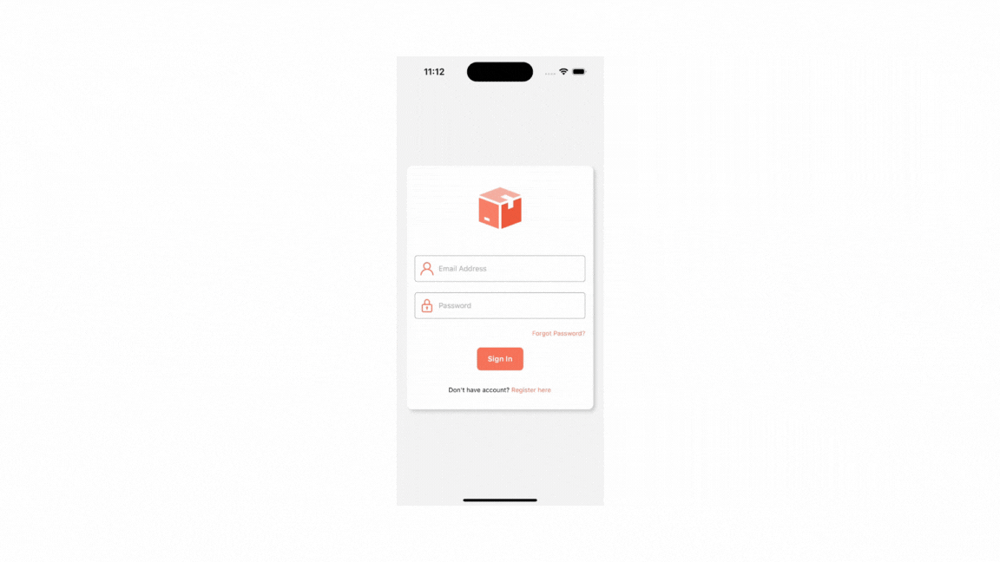

# BubbleBuzz 📱

Welcome to React Native ChatApp! This is a real-time messaging application built using React Native, allowing users to communicate seamlessly across different platforms.

# Features 🔥

💬 **Real-time Messaging:** Instantly exchange messages with other users in real-time.

🔐 **User Authentication:** Securely authenticate users with email and password.

📲 **Cross-Platform Compatibility:** Works seamlessly across iOS and Android platforms.

## Technologies Used ⚡

**React Native:** A JavaScript framework for building native mobile applications.

**Firebase:** A comprehensive platform for mobile and web application development, providing services like authentication, real-time database, and cloud storage.

## Getting Started 🚀

First, you will need to install **Node Modules**, which contains the dependencies (libraries) that your project relies on.

To Install **Node Modules**, run the following command from the root of your React Native project:

```bash
# using npm
npm install

# OR using Yarn
yarn install
```

Following the successful installation of **Node Modules**, the next step involves installing **pods** for iOS.

```
cd ios && pod install
```

If everything is set up _correctly_, you should see your new app running in your _Android Emulator_ or _iOS Simulator_ shortly provided you have set up your emulator/simulator correctly.

This is one way to run your app — you can also run it directly from within Android Studio and Xcode respectively.

## Start your Application ⚡

Let Metro Bundler run in its own terminal. Open a new terminal from the root of your React Native project. Run the following command to start your Android or iOS app:

### Running the Android app 🤖

```bash
# using npm
npm run android

# OR using Yarn
yarn android
```

### Running the iOS app 📱

```bash
# using npm
npm run ios

# OR using Yarn
yarn ios
```

If everything is set up correctly, you should see your new app running in your Android Emulator or iOS Simulator.

This is one way to run your app — you can also run it directly from within Android Studio and Xcode respectively.

## Congratulations! 🎉

You've successfully run your **BubbleBuzz** App. 🥳



## Authors

- [@NirmalsinhRathod👨🏻‍💻](https://github.com/NirmalsinhRathod)
